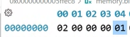
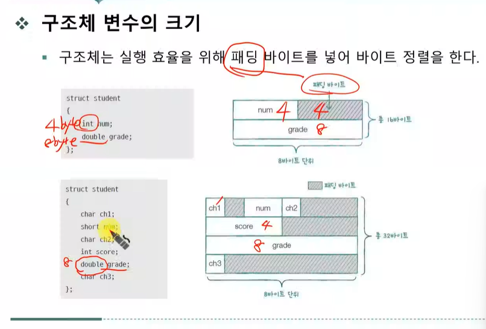
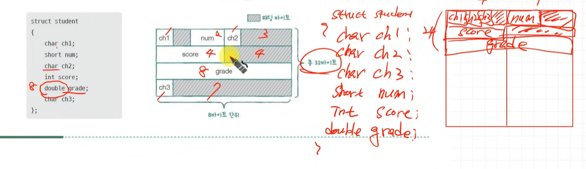

# 사용자 정의 자료형
## 구조체 
중요!!

```c
struct student{
    int num;
    double grade;
};

int main(){
    struct student s1;

    s1.num =2;
    s1.grade = 1.0;
}
```



구조체 메모리가 순서대로 할당된 모습


### 구조체 변수의 크기


padding 도 생각할 필요가 있다.

padding 안하고 연속적으로 붙이게 되면? -> 속도가 느려진다. -> 계산량이 많아져서



### 구조체 안에 구조체
[](./struct2.c)


### 열거형 (eunm)
열거형으로 자료형 구성하는거
`eunum season {SPRING, SUMMER, FALL, WINTER};`


### 전처리 지시자의 의미
