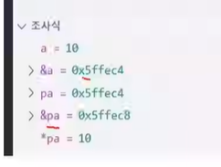
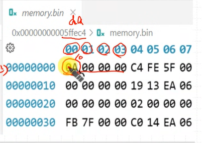
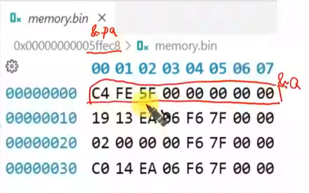
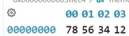
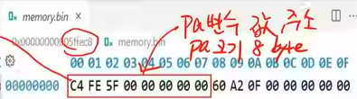
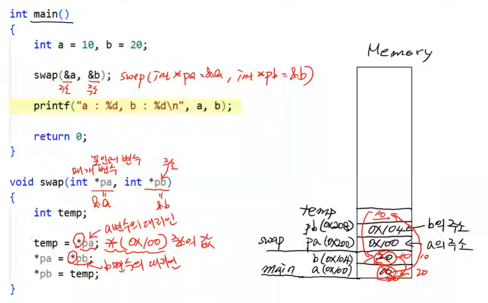

### 포인터를 왜 써야 할까?
- 메모리에 직접 접근하기 위해
- 주변장치를 제어하기 위해
 - CPU는 주변 장치를 메모리라 생각하고 바라본다.

> 포인터란?
주소를 저장하는 변수


**조사식**


**&a**
&a 주소 메모리에 저장된 값들 볼 수 있음


integer는 4 byte 짜리 변수.


**&pa**
&pa 주소 메모리에 저장된 값들 볼 수 있음



&a(a의 주소)를 저장하고 있음을 알 수 있다.


### little endian 과 big endian
Big Endian : 사람이 읽는 방식
Little Endian : CPU가 읽기 쉬운 방식
```c
*pa = 0x12345678;
```
`78`은 낮은 자리수, `12`는 높은 자리 수

Little endian은 낮은 자리수를 낮은 메모리 주소에 넣는다.



pa 변수 값 == a 의 주소



```c
int *pa
```

pa가 저장한 주소의 자료형은 `int` 이다.
포인터 크기는 8 byte 이지만 주소의 자료형이 나타나주어야함.
이 포인터가 담고있는 주소의 자료형은 `int`이고 4 byte 이다.


주소는 8byte -> ㅏ따라서 포인트 변수의 크기는 8 byte(64bit computer)


--- 

[Swap 함수 예제](./pointer3.c) 

